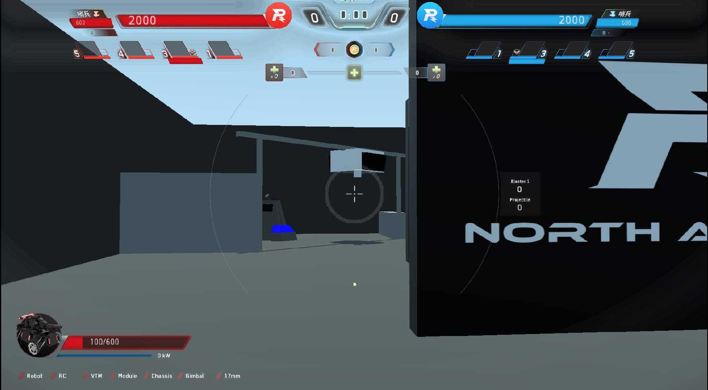

# Godot Robomasters game

**An online robomasters fps game for RMNA**

What is [Robomasters](https://www.youtube.com/watch?v=ECr4zgK6cPA)?

This Game was written using the [Godot](https://godotengine.org/) engine.
It was designed to emulate the Robomasters competition to help train pilots for 
our team.  
[Team websIte](https://robomasters-website.web.app/)

Limited support for Multiplayer.

## Web Client
**To just play by your self click:  
Continue -> Local (Lan) -> Host -> Start**

https://robomasters-website.web.app/game/RoboMastersGame.html

# Install
Only suports linux and windows:
[Install](https://github.com/agmui/RM_Game/releases/tag/v1.1)

### Windows:
To play download the `.exe` and `.pck`

Chrome might prevent you from downloading the .exe just accept.

Then windows defender page will show up.
Just press more info at the top and then hit Run anyways.

### Linux:
download and run `chmod` +x on the `.x86_64` file

currently, only LAN works and I don't have a server
